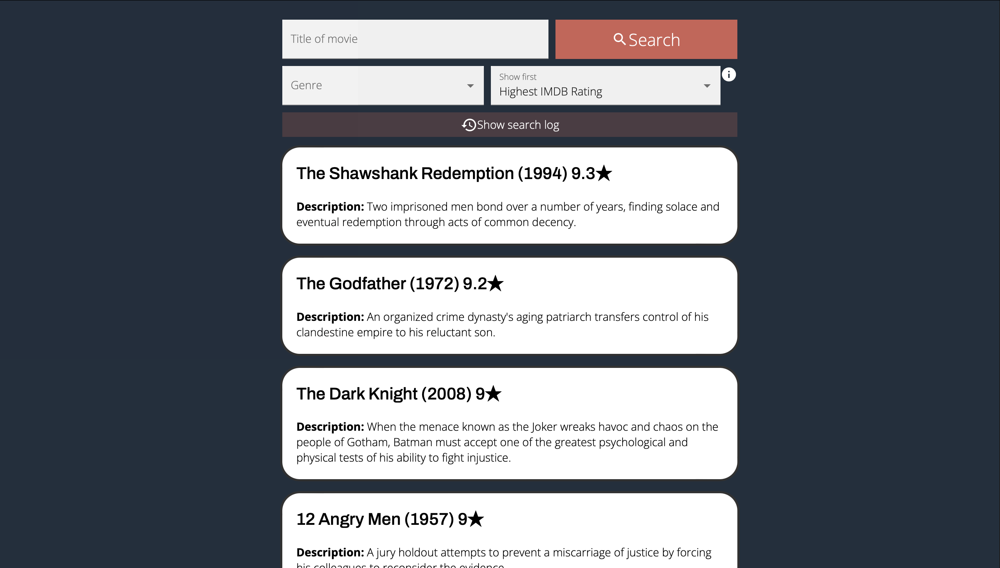
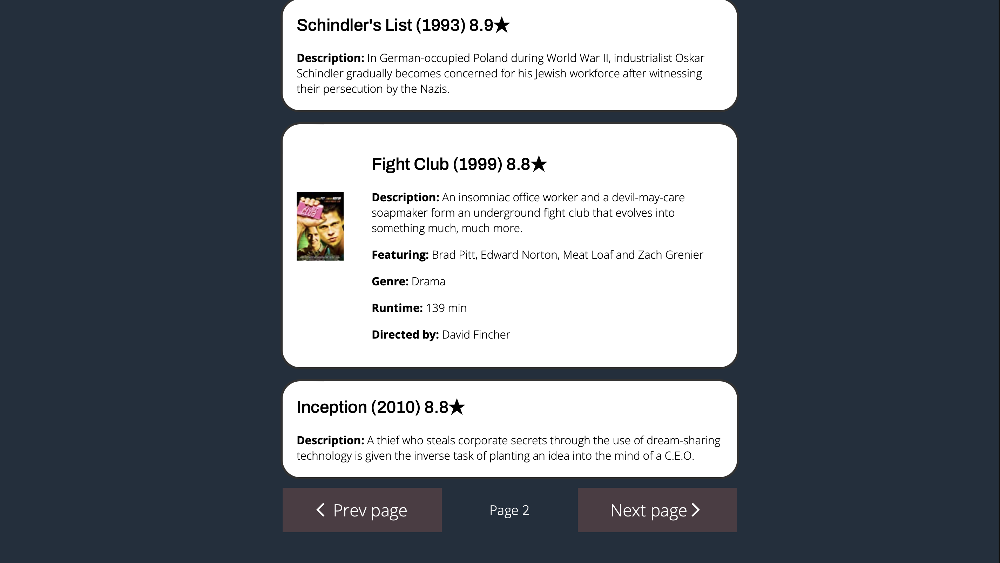
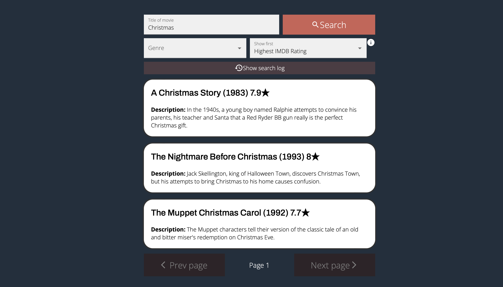
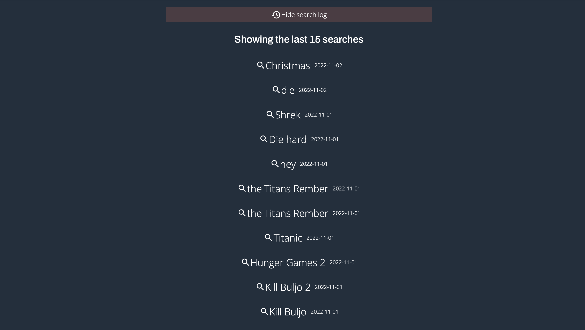

# Hvordan installere og kjøre prosjektet:
1. Åpne en ny terminal
2. `npm i`
3. `cd backend`
4. `npm i`
5. `npm start` (Neo4j database må kjøre for å få data)
6. Åpne en ny terminal
7. `cd frontend/movieSearchApp`
8. `npm i`
9. `npm start`

### Hvordan teste prosjektet
1. Gjør steg 1-9 i “Hvordan installere og kjøre prosjektet”.
2. Åpne en ny terminal
3. `npx cypress open`
4. Vent for pop up og trykk E2E Testing
5. Trykk Electron
6. Velg e2eTest
7. Når testen er ferdig, kryss ut og gå tilbake til terminalen
8. `cd frontend/movieSearchApp`
9. `npm test`

# Dokumentasjon for prosjekt 3

### GRAND-stack 
Vi har bygd opp nettsiden vår med GRAND-stacken. Denne består av GraphQL, React med TypeScript, Apollo og Neo4j database. Datasettet vi har i databasen består av de 1000 mest populære filmene på IMDB. Backend er bygd opp med Javascript og ikke Typescript da det var lite dokumentasjon for Apollo Server med Typescript og Neo4j som database. 

### Testing i Cypress og Jest
Vi har utført end-to-end testing med Cypress og komponenttesting med Jest. I end-2-end testingen testet vi nettsiden i helhet. Med Cypress kunne vi spesifisere hvilken element testeren skulle klikke på, og deretter sjekke om forventet oppførsel, som at forventede elementer dukker opp riktig, fungerte. Vi har en høy testgrad, ettersom vi testet alle knapper og felt på siden. Vi testet også komponentene i applikasjonen i isolasjon ved bruk av Jest. Der lagde vi mocks som etterlignet queries søk fra apollo, slik at vi kunne teste komponentene uavhengig av resten av prosjektet. Dette er for eksempel viktig for å sjekke at komponenten fortsatt virker som forventet ved eventuelle oppdateringer til prosjektet.

### Komponenter
Vi har valgt å bruke komponenter fra Material UI (MUI) for å bygge opp siden vår. Knapper, inputfelt og select-felter er alle hentet fra MUI slik at vi har sluppet å bruke tid på å lage dette selv. Disse komponentene har vi stylet videre slik vi har ønsket, som å gi annen farge, tekstfont ol. Verdiene som settes i disse komponentene håndterer vi videre i egenlagde komponenter.

### Søkefunksjonalitet
Hovedfunksjonalitet til siden er å søke etter filmer sin tittel. Dette gjøres helt øverst på nettsiden, og man må klikke på “Search” for at søket skal bli utført. Knappen og inputfeltet er plassert øverst slik at dette skal være lettest tilgjengelig. Det er mulig å ekspandere denne funksjonaliteten til å søke etter beskrivelse, skuespiller, regissør, etc, men det ble ikke tid til i denne iterasjonen.

### Filtrering og sortering
Brukeren kan filtrere filmer på sjanger og sortere filmene i stigende eller synkende rekkefølge basert på IMDB-rating. Dette kan også utføres i kombinasjon med søk etter tittel, samt navigering med pagination. Dersom man søker med tittel, så er det relevans (full text index-poengsummen) som vises først. Dette er den som viser hvor relevant filmtittelen er på tittelsøket. 

Dersom man søker med tittel så er det uansett sortert etter relevanse score i synkende rekkefølge (høyest relevanse score først). Det betyr at hvis man søker etter noe med tittel og så sorterer er det ikke sikkert at resultatet endres fordi det vil kun sortere mellom de filmene som har samme relevanse men ulik IMDB-rating.

### Universell utforming
Gruppa har fokusert på å få innholdet på nettsiden så leselig og forutsigbart, samt at vi hjelper brukeren der det er naturlig med infobokser og feilmeldinger. 

For å få innholdet på nettsiden leselig har vi valgt kontrastfarger, slik at tekst på ulike komponenter skal være lett å kunne lese. Vi har også valgt ulike farger til ulike komponenter på nettsiden, slik at det skal være lett for brukeren å skille ulik funksjonalitet. Søkeknappen er i en sterk farge slik at denne skal skille seg mest ut for brukeren.

Knappene har både tekst og et ikon for å sikre at nettsiden blir mer forutsigbar for ulike brukere. Vi har valgt å ha et søkeikon ved siden av “Search”, et historie-ikon ved siden av “Show search log” og ha pil-ikon til “Prev page” og “Next page”. Tanken bak dette valget er dersom noen brukere ikke vet hva “Search” ol. betyr, kan man klare å tenke seg til det ved å se på ikonet. I tillegg har vi lagt ved et infoikon ved siden av sorteringsfunksjonaliteten vår for å hjelpe brukeren i å forstå hvordan implementasjonen her fungerer. 

Videre har vi lagt på feilhåndtering i input-feltet til filmtittel, slik at brukeren ikke kan taste inn et utvalg spesialkarakterer. Dersom brukeren for eksempel prøver å taste inn “!” vil brukeren få en alert som sier at det er ugyldig tegn, samt at tegnet ikke kommer inn i inputfeltet. Ellers er det synlig melding til brukeren dersom søkeresultatet ikke inneholder filmer eller at søkehistorikken er tom. 

### Responsivitet
Nettsiden sin funksjonalitet fungerer fint uavhengig om enheten er en pc, et nettbrett eller en mobil. Vi har innført @media queries som kalles når skjermen er mindre enn 750px. Dessuten har MUI-komponentene god støtte for responsivitet når skjermstørrelsen endres.  

### Fargevalg
Til dette prosjektet har vi gått for et litt mørkere tema enn i forrige prosjekt, etter at vi ble oppmerksom på at lyse farger krever mer energi. Av den grunn har vi gått for et mørkt bakgrunnstema slik at siden bruker mindre energi og sparer øynene til brukeren.

### Apollo Local State Management
Vi lagrer tittelen brukeren søker etter i Apollo Local State Management ved hjelp av useReactiveVar(). Slik at kan vi nå tittelen over hele appen uten å måtte sende tittelen som props. Dette kommer godt med da titlene brukeren har søkt etter er sentral i store deler av applikasjonen. Når brukeren klikker på et søkeord i loggen, så setter vi useReactiveVar() til å være søkeordet, og så viser man frem filmene relatert til søkeordet.

### Simulering av bruker
På nettsiden vår har vi implementert logikk for lagring av søk, slik at hvert søk vil lagres og være tilgjengelig for brukeren. Planen vår var å implementere innlogging, slik at disse søkene ville lagres på den bestemte brukeren man hadde logget inn med. Etter å ha prøvd lenge på dette og kommet langt, men ikke lyktes helt, gikk vi bort fra dette. Vi bestemte oss for at dette ikke ville være en fornuftig prioritering. Det var fortsatt mye funksjonalitet vi manglet og vi skjønte at denne nedprioriteringen fortsatt ville sikre at vi fulgte kravene for prosjektet. Dermed bestemte vi oss for en løsning hvor man lagrer søk uavhengig av bruker.

### Brukergenererte data
Vi lager mutations i databasen basert på tittelen en bruker søker etter, dette blir lagret som søkeord i databasen sammen med tidspunktet søket ble gjort. Denne dataen bruker vi igjen i søkeloggen vår, som viser brukerens 15 siste søk. Vi sorterer søkene med nyligst søk ved å bruke DESC på “created”, altså når søket ble gjort. Dersom brukeren klikker på søkeordet vil man gjøre et søk med tittelen. 

### Mer detaljert view
Default view av filmene er tittel, årstall, IMDB-rangering og beskrivelse. Dersom brukeren klikker på en film, vil et mer detaljert visningsvindu vises hvor vi har tatt med bilde av poster, skuespillere, sjanger, regissør og lengde på filmen. Det detaljerte vinduet lukkes med en gang brukeren klikker seg utenfor boksen som filmen er i. Slik er det lett for brukeren å effektivt bytte film man vil se mer detaljert på. For å indikere for brukeren at vinduet kan utvides, vises det på musepekeren at boksen kan klikkes på. 

### Pagination
For å sørge for at vi ikke henter all data på en gang, i tillegg til å skape en bedre brukeropplevelse, har vi innført pagination. Vår pagination er basert på offset og limit. Vi har satt limit til maks fem filmer, og når man klikker på neste side så økes offset med fem. Slik får da brukeren se de neste fem filmene, uten at vi trenger å laste inn alle filmene i databasen. Dersom brukeren går tilbake, så gjøres det ikke et nytt søk etter filmer som allerede har vært vist. Disse blir lagret i Apollo sin cache, slik at man slipper å gjøre queries på data som nettopp har blitt vist. 

Hele poenget med Graphql er at man skal kunne hente spesifikk data og ikke hente alt med en gang. Ved å innføre pagination unngår vi derfor problemet med overfetching.

### Gitlab
Vi har brukt Git og Gitlab under utviklingen av nettsiden. Alle commits er linket opp mot #issue, som igjen er koblet til en branch for issuet. Hver commit starter med hvilken issue den er knyttet til. Slik er det lett å få oversikt over hvilke commits som gjelder hvilke issues. 

Ved merge requests er det aldri personen som starter merge requesten som godkjenner. Merge requesten ses over og godkjennes av en eller flere andre gruppemedlemmer. Dette gjør vi for å sikre at en merge request bidrar med kvalitet, og at man ikke pusher inn kode som ikke virker.

### Bilder av nettsiden

